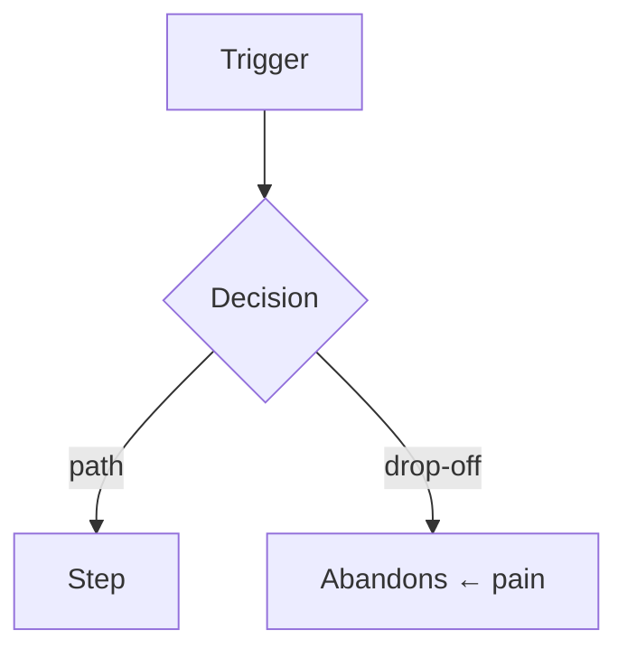

# Fill-in templates

Copy the ones the problem needs. Render inline (tables/Mermaid show directly). Leave out
any row or field you have no grounded answer for — an empty cell is honest; an invented one
is noise. Mark unverified entries `(assumption)`.

---

## Stakeholder map

| Stakeholder | Role in the problem | Interest | Influence | What they need |
|-------------|---------------------|----------|-----------|----------------|
| e.g. Advisor | Lives in the flow daily | High | Low | Fewer clicks to reassign |
| e.g. Team lead | Approved the work | Med | High | Visibility into coverage |

Or, when influence/interest is the axis that matters, a power/interest grid:

```
High influence │  Keep satisfied      │  Manage closely
               │  (team lead)         │  (primary user)
───────────────┼──────────────────────┼──────────────────
Low influence  │  Monitor             │  Keep informed
               │  (adjacent team)     │  (support)
               └──────────────────────┴──────────────────
                 Low interest            High interest
```

## Persona card

One per distinct segment. Only fields that change a decision.

- **Segment:** who they are in one phrase
- **Context:** where/when/under what pressure they use it
- **Goal:** what success looks like for them
- **Constraint:** the thing that most limits them (skill, time, device, access)
- **Evidence:** where this comes from — or `(assumption)`

## Job story

> When **[situation]**, I want to **[motivation]**, so I can **[expected outcome]**.

Keep it solution-neutral: situation + motivation + outcome, no mechanism.

## Journey map

| Stage | What they do | What they think/feel | Pain / drop-off |
|-------|--------------|----------------------|-----------------|
| 1. Trigger | … | … | … |
| 2. … | … | … | ← pain point |
| 3. Outcome | … | … | … |

Map **current state** first (where the pain is). A Mermaid alternative for branching flows:



## User story

> As a **[user/persona]**, I want to **[capability]**, so that **[benefit]**.

Tie each to a job. No acceptance criteria, estimates, or priority — that's the tracker.

## Affordance / capability checklist

Keyed to journey steps. Each entry is a required capability, not a UI element.

| Journey step | The user must be able to… | For which user |
|--------------|---------------------------|----------------|
| Reassign | see which records are unassigned | Advisor |
| Reassign | reassign a record to a teammate | Advisor |

Name what must be *possible and obvious*. Widgets, layout, and mechanism belong to
`arch-design`.
