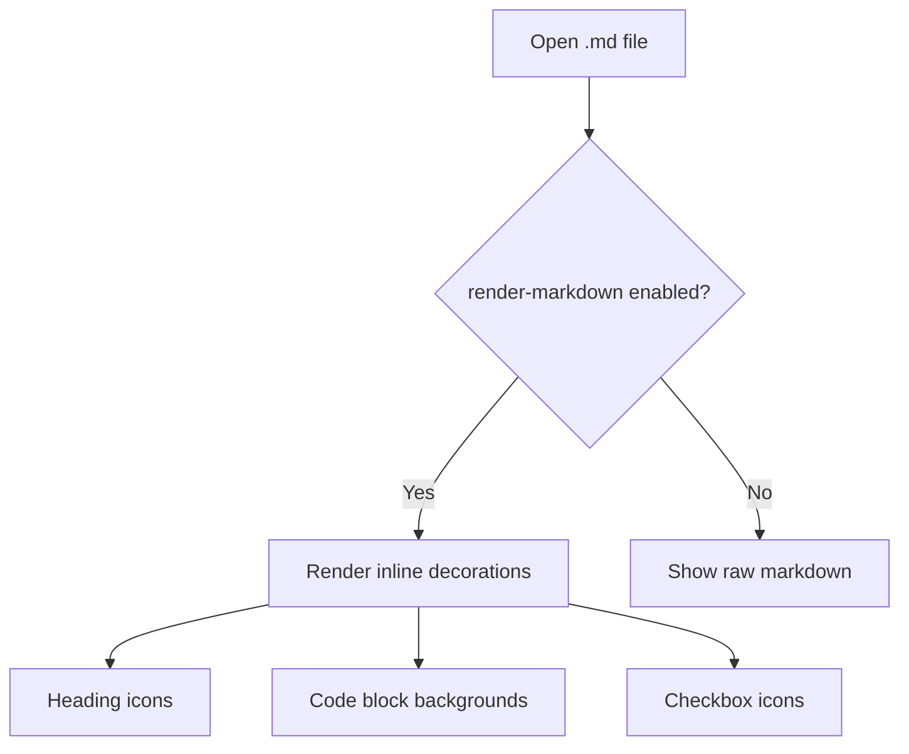
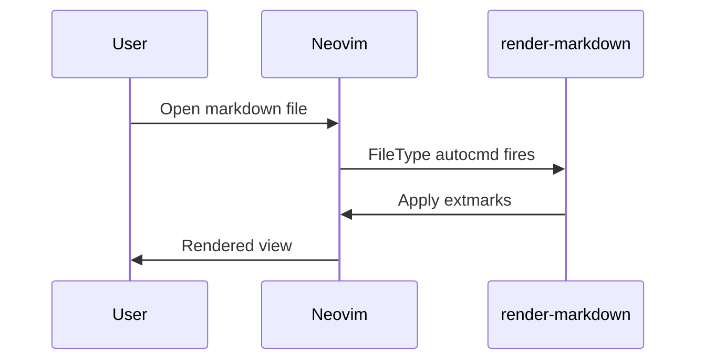

# Markdown Smoke Test

## Headings

# H1 Heading
## H2 Heading
### H3 Heading
#### H4 Heading
##### H5 Heading
###### H6 Heading

---

## Text Formatting

Regular paragraph with **bold text**, *italic text*, ~~strikethrough~~, and `inline code`.

> This is a blockquote.
> It can span multiple lines.

---

## Lists

### Unordered (Bullets)

- First item
- Second item
  - Nested item
  - Another nested
    - Deeply nested
- Third item

### Ordered

1. First step
2. Second step
3. Third step

### Task List (Checkboxes)

- [x] Completed task
- [ ] Incomplete task
- [x] Another done item
- [ ] Still pending

---

## Code Blocks

### Lua

```lua
local function greet(name)
  return string.format("Hello, %s!", name)
end

print(greet("world"))
```

### Ruby

```ruby
def greet(name)
  "Hello, #{name}!"
end

puts greet("world")
```

### TypeScript

```typescript
const greet = (name: string): string => `Hello, ${name}!`;

console.log(greet("world"));
```

### Shell

```bash
#!/bin/bash
echo "Hello, world!"
for i in {1..3}; do
  echo "Count: $i"
done
```

### JSON

```json
{
  "name": "smoke-test",
  "version": "1.0.0",
  "dependencies": {
    "render-markdown.nvim": "latest"
  }
}
```

---

## Tables

| Plugin | Purpose | Status |
|--------|---------|--------|
| render-markdown.nvim | Inline rendering | ✅ Enabled |
| obsidian.nvim | Note-taking | ✅ Enabled |
| md-render.nvim | Preview | ❌ Removed |
| markdownlint-cli2 | Linting | ❌ Disabled |

---

## Callouts / Admonitions

> [!NOTE]
> This is a note callout. Useful for supplementary information.

> [!TIP]
> Pro tip: use `<leader>um` to toggle markdown rendering on/off.

> [!WARNING]
> This is a warning. Something might go wrong here.

> [!IMPORTANT]
> This is important information that shouldn't be skipped.

> [!CAUTION]
> Be careful — this action cannot be undone.

---

## Links

- [External link](https://github.com/MeanderingProgrammer/render-markdown.nvim)
- [Relative file link](./nvim/.config/nvim/lua/plugins/markdown.lua)
- Bare URL: https://neovim.io

---

## Images


---

## Mermaid Diagram





---

## SVG (as fenced code block)

```svg
<svg xmlns="http://www.w3.org/2000/svg" width="100" height="100">
  <circle cx="50" cy="50" r="40" stroke="green" stroke-width="4" fill="yellow" />
</svg>
```

---

## Math / LaTeX

Inline math: $E = mc^2$

Block math:

$$
\int_{-\infty}^{\infty} e^{-x^2} dx = \sqrt{\pi}
$$

---

## Horizontal Rules

Above

---

Below

***

Also below

---

## Long Paragraph

Lorem ipsum dolor sit amet, consectetur adipiscing elit. Sed do eiusmod tempor incididunt ut labore et dolore magna aliqua. Ut enim ad minim veniam, quis nostrud exercitation ullamco laboris nisi ut aliquip ex ea commodo consequat. Duis aute irure dolor in reprehenderit in voluptate velit esse cillum dolore eu fugiat nulla pariatur.
